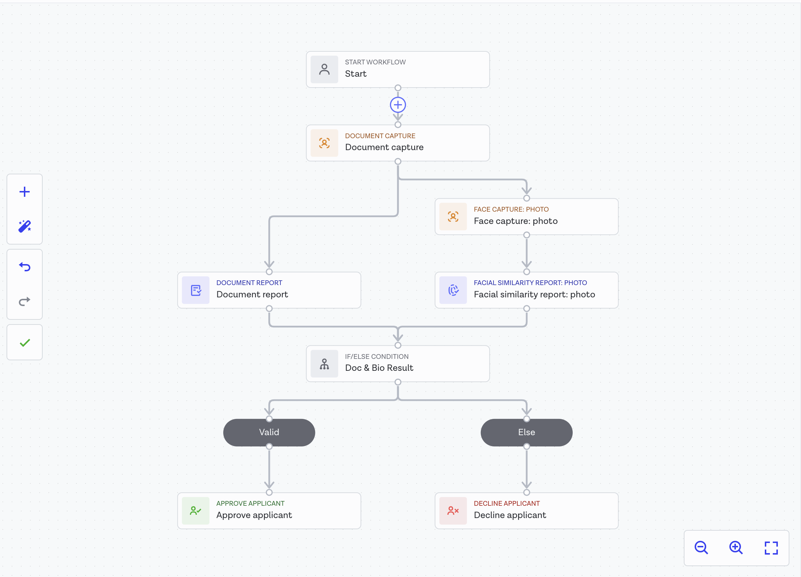
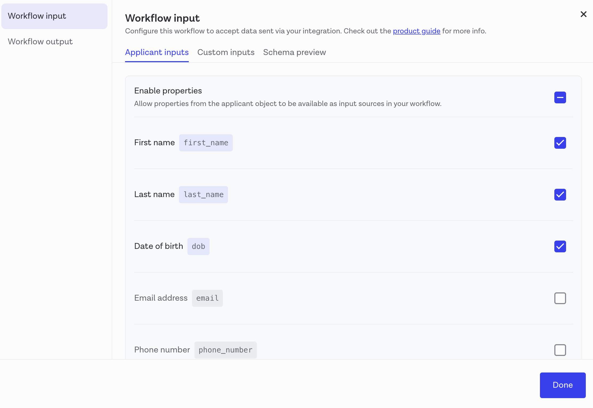

## Creating a Workflow in Onfido Studio

Onfido Studio allows you to create dynamic end-user verification journeys using the Workflow Builder, 
a no-code, drag-and-drop interface available directly through the Onfido Dashboard. 
This interface lets you build, maintain, and update workflows without requiring developer involvement.

When using the WSO2 Onfido connector for identity verification, you need to create a workflow that, 
at a minimum, includes document data capture. Optionally, you can also integrate face capture into the workflow.

### Important Notes:

- **Workflow Inputs:** You must configure the workflow to accept the necessary user attributes for verification. 
Ensure that the required attributes are supported for verification.
- **Workflow Outputs:** It's mandatory to configure the workflow outputs to include data comparison results, 
which will be sent in the webhook response. Make sure that Comparison Checks are enabled and the workflow output 
is configured appropriately. For more details, refer to 
[Onfido's Comparison Checks documentation](https://documentation.onfido.com/api/latest/#data_comparison).

### Follow these steps to create a simple workflow for user attribute verification:

#### Step 1 : Access Workflow Builder:

- Log in to the Onfido Dashboard. 
- Navigate to the **Workflows** section.

#### Step 2 : Create a New Workflow:

- Click on the **New Workflow** button.
- Click on **New Version** to be redirected to the Workflow Builder page.

#### Step 3 : Design the Workflow:

- Use the drag-and-drop interface to design the workflow, ensuring it includes the necessary steps for document 
capture and, optionally, face capture, as shown in the sample reference image. In this case, the workflow includes 
document verification and face similarity reports for identity verification.

  

#### Step 4 : Configure Workflow Inputs:

- Configure the workflow to accept first name and last name as input attributes. For detailed instructions on 
setting up inputs, refer to the [Onfido Studio Input Data documentation](https://documentation.onfido.com/getting-started/onfido-studio-product/#workflow-input-data).
- Note : If you wish to use the sample application, ensure that you also enable date of birth.

  

#### Step 5 : Configure Workflow Outputs:

- Set up the workflow to return data comparison results by following these steps:
    1. Go to the workflow output configuration section.
    2. Under the **Configure** tab, add a new property named `data_comparison` and set its format to `Other`.
      
    3. Navigate to the **Sources** tab, and under both `APPROVE APPLICANT` and `DECLINE APPLICANT`, select 
   `Document report - Breakdown - Data comparison - Breakdown`.
      
    4. Click the **Done** button.
- For more information, refer to the [Onfido Studio Output Data documentation](https://documentation.onfido.com/getting-started/onfido-studio-product/#workflow-output-data).
- **Note** : To ensure the accuracy of user attribute verification, it is crucial to configure the output in the specified format. 
The verification status depends on the result of the data comparison combined with the workflow status. 
Additionally, make sure Comparison Checks are enabled in your Onfido account to receive these results in the 
webhook response. For more information, refer to [Onfido's Comparison Checks documentation](https://documentation.onfido.com/api/latest/#data_comparison).

#### Step 6 : Set Workflow Conditions:

- To specify the criteria for approving or declining an applicant, click on the if/else condition task block. 
Set the condition to check that both the document report and optionally face capture report results are marked as clear.
If both are **clear**, the applicant can be approved. Otherwise, the application should be declined.
You can add additional conditions based on your requirements, but keep in mind that the WSO2 Identity Server 
will only mark the attribute verification as successful if the workflow returns an approved status for the applicant.

#### Step 7 : Save the Workflow:

- Review the workflow and click **Save** to finalize the setup.

By following these steps, you will have successfully created a minimalistic workflow in Onfido Studio for user
attribute verification.

## Creating an API Token in Onfido Dashboard

To create an API token:

1. Log in to the [Onfido Dashboard](https://dashboard.onfido.com/).
2. Go to **Settings** > **Developers** > **Tokens**.
3. Click **Generate API token**.
4. Select **Live** as the environment and click **Generate**.
5. Copy the generated API token and store it securely for later use.

## Creating a Webhook Token in Onfido Dashboard

Onfido provides webhooks to notify your system about changes in the status of identity verifications. 
Once Onfido is integrated, WSO2 Identity Server can automatically update users' verification status based on 
notifications from Onfido. For more information, refer to the [Onfido webhooks documentation](https://documentation.onfido.com/api/latest/#webhooks).

Follow the steps below to create a webhook token:

1. On the [Onfido Dashboard](https://dashboard.onfido.com/), navigate to **Settings** > **Developers** > **Webhooks**.
2. Click Create webhook.
3. Once you Add Onfido as a connector in WSO2 Identity Server, a URL will be generated for the connector. 
Copy the URL from the **Setup Guide** tab of your Onfido connector in WSO2 Identity Server.
4. Paste the copied URL into the webhook URL field and select only the **workflow_run.completed** event.
5. Click **Save**.
6. Copy the webhook token, as it will be needed to complete the webhook configuration in Asgardeo.